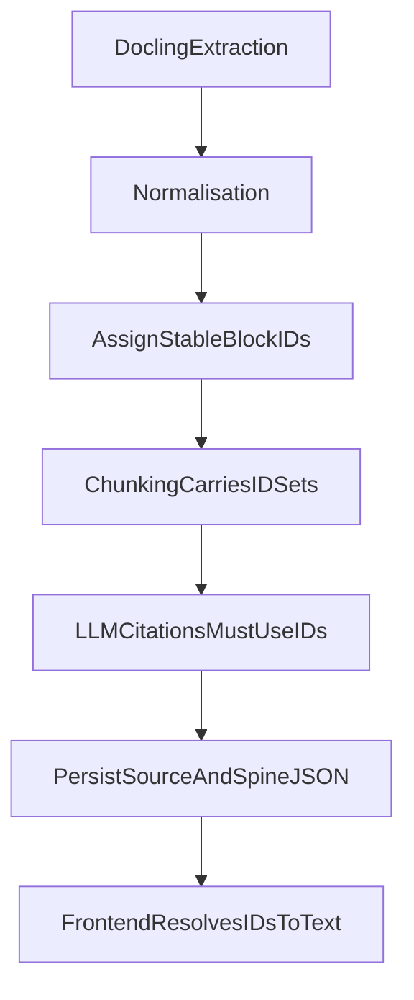

# Source Integrity Rules

## Why not page numbers

EPUB is reflowable. Page numbers are unstable across readers and renderers. This product uses **stable source-block IDs**.

## ID format

```text
{book_id}.{chapter_id}.{section_id}.{block_id}
```

Example:

```text
human-compatible.ch03.sec02.block014
```

Rules:

- Lowercase kebab-case or zero-padded numeric suffixes for ordered parts
- Unique within a book
- Assigned once at normalisation for a given upload job
- Never regenerated for the same stored chapter artefact

## Lifecycle (stability)



| Stage | Rule |
|-------|------|
| Docling extraction | May use temporary structural indices only |
| Normalisation | Creates canonical blocks and permanent IDs |
| Chunking | Passes subsets of existing IDs; does not mint new content IDs |
| LLM processing | May only cite IDs present in the chunk/chapter allow-list |
| Storage | Source chapter JSON is the ID authority |
| Frontend | Looks up `block_id` → `text` from stored source chapter |

## Validation

- Every `source_block_ids` entry on a spine node must exist in that chapter’s source document
- Unknown IDs fail validation → repair retry → fail chapter if unresolved
- Duplicate node IDs within a spine are invalid
- Empty citation lists allowed only when `source_status` and schema permit (e.g. some `external_counter` cases), with warnings preferred

## Frontend preview

Users can open/preview the original text for an Argument Spine node via its `source_block_ids`. Preview reads stored normalised text—not a live EPUB re-parse—so IDs remain consistent with what the model saw.

## Reference fixture caveat

[`../sample-data/reference/a_thousand_brains_clean.json`](../sample-data/reference/a_thousand_brains_clean.json) does **not** yet use this ID scheme. It is a pre-normalisation structural fixture. Phase 2 normalisation defines the ID authority for real uploads. See [`../sample-data/README.md`](../sample-data/README.md).

## Non-negotiables

1. Do not invent block IDs in prompts or repair steps.
2. Do not cite blocks from other chapters.
3. Do not treat Argument Spine prose as a substitute for source text.
4. Do not drop source IDs during Hindi-English adaptation.
