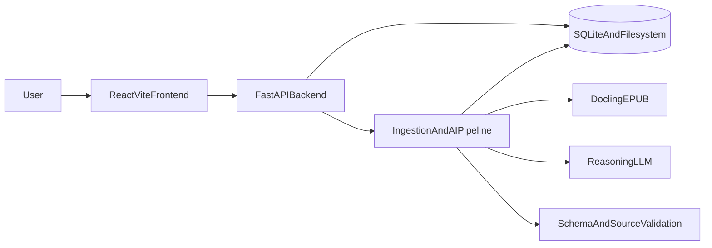
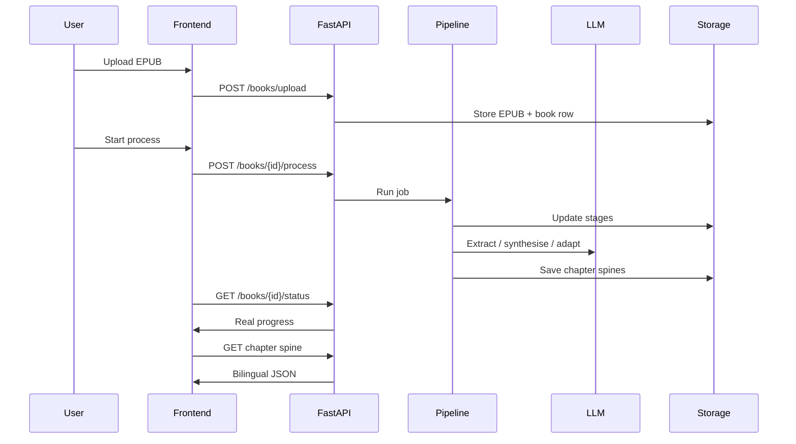

# System Architecture

## Principle

Keep three concerns separate:

```text
Content extraction logic  →  AI pipeline
Platform implementation   →  Cursor (backend + frontend + storage)
Visual design             →  Claude Design (later implemented by Cursor)
```

GitHub is the single source of truth for code, schemas, prompts, and documentation.

## High-level components



## Backend (Python / FastAPI)

Single service owns:

| Area | Responsibility |
|------|----------------|
| API | Upload, process, status, metadata, chapters, spine, retry, delete, demo reset |
| Ingestion | EPUB validation, Docling conversion |
| Normalisation | Strip noise, detect chapters, assign stable block IDs |
| Chunking | Structure-first chunks for oversized chapters |
| Orchestration | Extraction → synthesis → Hindi-English → validation → persist |
| Storage | Filesystem artefacts + SQLite job/metadata state |

Package layout (scaffold):

```text
backend/app/
  api/          # HTTP routes
  domain/       # entities and enums
  services/     # upload, status, books
  pipelines/    # ingest, normalise, extract, synthesise, adapt
  schemas/      # Pydantic models mirroring schemas/
  prompts/      # versioned prompt files
  storage/      # filesystem + SQLite adapters
  utils/        # shared helpers
```

## Frontend (React + TypeScript + Vite)

Consumes API only. Must not embed hardcoded chapter Argument Spine content.

Feature areas:

- Upload
- Processing progress
- Book Map
- Chapter Argument Spine renderer
- Language toggle
- Source preview
- Error / empty / loading states

## Storage (MVP)

**Choice: local filesystem + SQLite.**

| Asset | Location |
|-------|----------|
| Uploaded EPUB | `data/uploads/{book_id}/` |
| Docling / raw extract | `data/processed/{book_id}/docling.json` |
| Normalised chapters | `data/books/{book_id}/chapters/{chapter_id}.source.json` |
| Argument Spine JSON | `data/books/{book_id}/chapters/{chapter_id}.spine.json` |
| Book metadata snapshot | `data/books/{book_id}/metadata.json` |
| Logs / JSONL | `data/logs/` |
| Jobs, status, retries | SQLite (`book_decode.db`) |

### Options considered

| Option | Pros | Cons | MVP verdict |
|--------|------|------|-------------|
| Local filesystem only | Simple | Weak query/status model | Insufficient alone |
| SQLite + filesystem | Simple, queryable jobs, portable | Single-node | **Selected** |
| PostgreSQL | Strong concurrency | Ops overhead for prototype | Later |
| Object storage (S3) | Scale | Needs local/dev substitute | Later |

Content JSON schemas stay storage-agnostic so migration does not redesign the Argument Spine contract.

## Data flow



## Frontend / backend boundary

| Frontend owns | Backend owns |
|---------------|--------------|
| Presentation and interaction | EPUB processing and AI |
| Calling status endpoints | Authoritative processing state |
| Language toggle rendering | Bilingual field generation |
| Source preview UI | Source-block resolution from stored chapter JSON |

## Configuration

Environment variables: see root [`.env.example`](../.env.example). LLM provider is OpenAI-compatible and swappable via `LLM_API_BASE` / `LLM_MODEL`.

## Related docs

- [AI Pipeline](AI_PIPELINE.md)
- [API Specification](API_SPECIFICATION.md)
- [Data Schema](DATA_SCHEMA.md)
- [Processing States](PROCESSING_STATES.md)
